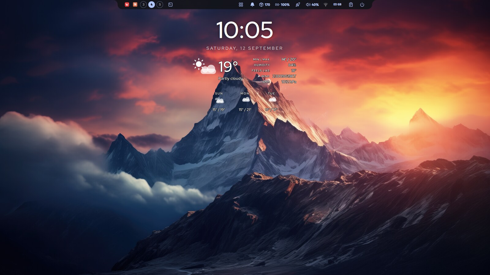
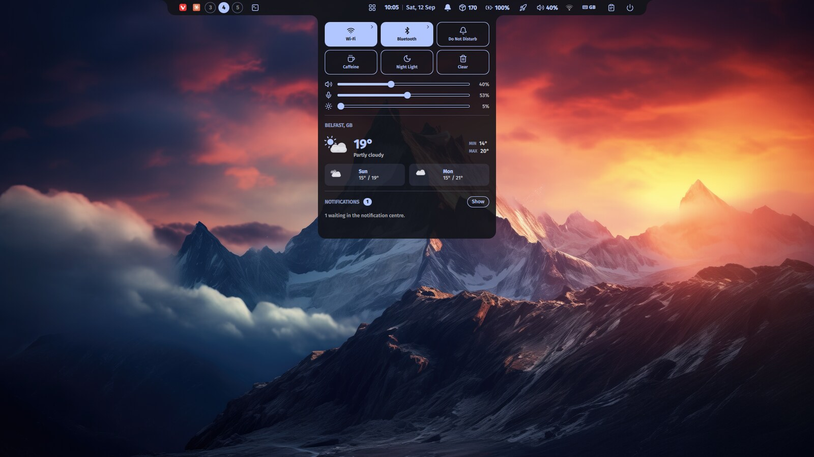
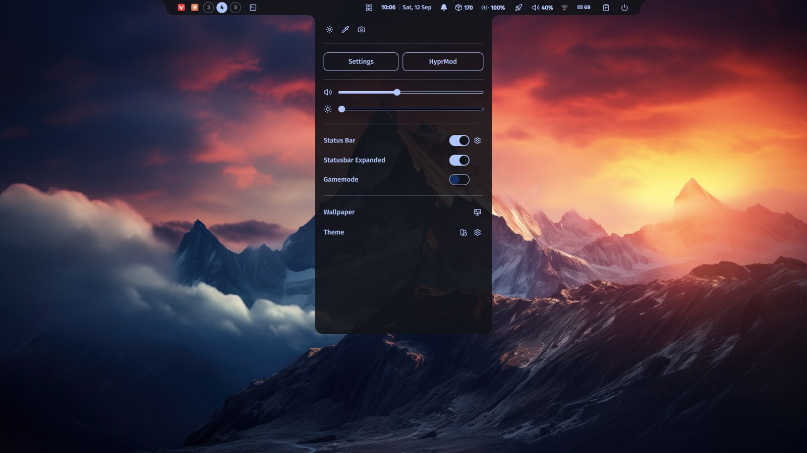
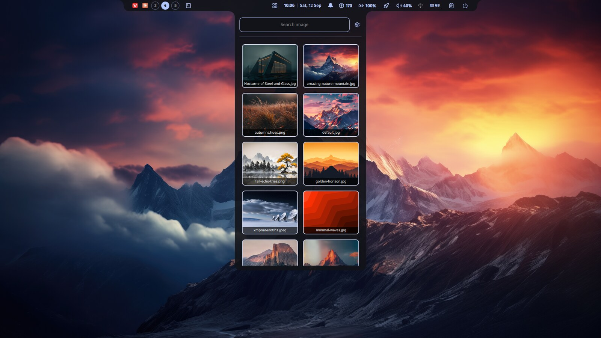

# dotfilesLaptop

My own take on ML4W dotfiles. Repo setup to be used with gnu stow.



The idea is to use the power of Quickshell to have most of the apps dropping
out of the statusbar. There is a time and weather widget above, which lives on
empty workspaces only, but it can be toggled in the top bar menu, which is  
called via SUPER+CTRL+S.

It started as [ML4W OS](https://github.com/mylinuxforwork/dotfiles) 2.14.1 by
Stephan Raabe, and a good part of it is still his work, which includes the
wallpapers, updates script, and a lot more is carried over from ML4W dotfiles.
What I changed in his files is listed under [Changes from ML4W](#changes-from-ml4w).

This customisation is heavily assisted by Claude AI. Nobody with twin toddlers
and a full-time job that has nothing to do with developing has the time to
configure all this. I wanted something to fit my needs based on the great
job done by Stephan Raabe and his ML4W dotfiles.

## Screenshots

Following ML4W philosophy, the items displayed in the quickshell statusbar
can be modified by changing `~/.config/ml4w/settings/statusbar.json`.


<details>
<summary>The apps that drop down from the statusbar</summary>

Control centre — toggles, sliders, the weather and the notification count.
At the moment, notifications are still handled by Swaync.
Wi-Fi and Bluetooth open sub-pages in place. Clicking the place name above the
weather turns it into a text field, which modifies the fetch to display the weather
in both control centre and the widget. It is the `controlcentre` module, a set of
sliders in the bar, with a mark under the glyph while notifications are waiting
and a bar there while Do Not Disturb is on. It still answers to its old name,
`notifications`, in both `statusbar.json` and `qs ipc`.



The Settings panel, on its Statusbar tab.


The sidebar, weather widget and gamemode switches, wallpaper and theme, and a way into
Settings.



The wallpaper picker. Picking one runs matugen, which recolours the bar, GTK,
kitty, rofi, btop and swaync.



</details>

## Packages

Each folder is a [stow](https://www.gnu.org/software/stow/) package that mirrors `~`, so `hypr/.config/hypr` becomes
`~/.config/hypr`.

| Package                                                     | Becomes                                                      | What it is                                                                                               |
| ----------------------------------------------------------- | ------------------------------------------------------------ | -------------------------------------------------------------------------------------------------------- |
| `hypr`                                                      | `~/.config/hypr`                                             | Hyprland config (Lua), keybindings in `conf/keybindings/gabriel.lua`, hyprlock, hypridle                 |
| `quickshell`                                                | `~/.config/quickshell`                                       | the bar, the desktop widget and all the panels, including Settings                                       |
| `ml4w`                                                      | `~/.config/ml4w`                                             | ML4W's scripts this setup still uses (wallpaper, cliphist, updates, toggles), settings files, wallpapers |
| `matugen`                                                   | `~/.config/matugen`                                          | templates for the colours generated from the wallpaper                                                   |
| `rofi`, `swaync`, `kitty`, `fastfetch`, `btop`, `qt6ct`     | `~/.config/…`                                                | app configs                                                                                              |
| `nvim`                                                      | `~/.config/nvim`                                             | LazyVim, with LSP, DAP for C, LaTeX and snippets                                                         |
| `vim`                                                       | `~/.config/vim/.vimrc`                                       | plain vim, for when nvim is not there                                                                    |
| `browserflags`                                              | `~/.config/chromium-flags.conf`, `~/.config/edge-flags.conf` | Wayland flags for Chromium and Edge                                                                      |
| `gtk-2.0`, `gtk-3.0`, `gtk-4.0`, `xsettingsd`, `xresources` | `~/.gtkrc-2.0`, `~/.config/…`, `~/.Xresources`               | GTK theme, ArcStarry cursor, kora icons                                                                  |
| `fonts`                                                     | `~/.local/share/fonts/Fira_Sans`                             | Fira Sans, which the bar, rofi and hyprlock use                                                          |
| `cursors`                                                   | `~/.local/share/icons/ArcStarry-cursors`                     | the cursor theme                                                                                         |
| `zsh`                                                       | `~/.zshrc`                                                   | shell config                                                                                             |
| `ohmyposh`                                                  | `~/Documents/mytheme_v2.toml`                                | prompt theme `.zshrc` loads                                                                              |
| `systemd`                                                   | `~/.config/systemd/user/hyprland-session.target`             | started by `autostart.lua`                                                                               |
| `xdg-desktop-portal`                                        | `~/.config/xdg-desktop-portal/portals.conf`                  | Hyprland portal first                                                                                    |

Stow `systemd`, `xdg-desktop-portal` and `ohmyposh` with `--no-folding`, so
stow doesn't turn `~/.config/systemd` or `~/Documents` into a link to the repo.

## Installing on a new machine

Please, verify the packages below. Remember that Copr, AUR, are user packages.

1. **Packages.** On Fedora, enable the COPRs listed at the top of
   `packages-fedora.txt`, then:

   ```bash
   sudo dnf install $(grep -v '^#' packages-fedora.txt)
   ```

   On Arch:

   ```bash
   paru -S --needed $(grep -v '^#' packages-arch.txt)
   ```

   Why am I not listing others? Those are the distros I run, I have not tested this in anything else.

2. **Things to dowloand.** Both package files list them at the
   top: matugen, oh-my-posh, nwg-displays, the kora icons, grimblast on
   Fedora, and the calculator and emoji-picker flatpaks.

3. **Stow everything:**

Use GNU Stow to manage these dotfiles.

```bash
cd ~/.dotfilesLaptop
stow hypr quickshell ml4w matugen rofi swaync kitty fastfetch btop qt6ct \
     nvim vim browserflags gtk-2.0 gtk-3.0 gtk-4.0 xsettingsd xresources \
     fonts cursors zsh
stow --no-folding systemd xdg-desktop-portal ohmyposh
fc-cache -f
```

`~/.zshrc` is usually a plain file already, so move it aside before
`stow zsh`.

1. **Log in.** Pick Hyprland at the login screen.

## Time and weather widget

The widget sits on an empty workspace. Open a window, or switch to a workspace
that has one, and it is sucked up into the bar, which takes the clock back over
at the same moment. Once you change to an empty workspace, it will be thrown out
of the statusbar once again, giving place to a calendar icon, which opens ML4W
calendar app. It can be toggled in the sidebar (which now comes from the top).

Three sections: the time with the day and date under it, current conditions,
and a three-day forecast.

Only the workspace decides. Dropping a panel out of the bar leaves the widget
where it is — the panels are drawn over the top of it — so opening the settings,
the wallpaper picker or the power menu no longer throws the clock back into the
bar and out again.

While the widget has the time, the bar's clock folds away and a calendar button
unfolds into the gap it leaves, so the calendar is still one click away from the
middle of the bar. The two trade places: the button folds itself away again as
the widget is sucked in and the clock returns.

Weather comes from [Open-Meteo](https://open-meteo.com/), which needs no API
key. It refreshes every 15 minutes, and retries every 20 seconds until the
first success, since the network is usually not up yet at login.

Wind is written the way a METAR does: `23009G19KT` is 230° at 9 knots gusting
19, with the gust shown only when it is 10 knots or more above the mean. Calm
is `00000KT` and north is `360`. The arrow points the way an aviation wind barb
does, at the direction the wind comes from. `QNH` is pressure at mean sea level
in hPa.

Matugen derives the palette from the
wallpaper, but light and dark are a user choice, so a pale wallpaper can arrive
with a dark palette. The widget samples the brightness of the wallpaper behind
it and picks white or near-black ink, and samples again when the wallpaper
changes.

### Setting the location

Three ways, all of which end up in the same place:

- **Settings panel** → Statusbar tab.
- **Control centre** → click the place name above the weather. It becomes
  a text field; Enter or clicking away saves it.
- **IPC:**

  ```bash
  qs ipc call statusbar weatherLocation
  qs ipc call statusbar setWeatherLocation "Porto, PT"
  ```

The bar owns `~/.config/ml4w/settings/statusbar.json`, so both front ends go
through its IPC rather than editing the file. A change travels back as a
binding, so the widget re-geocodes without being told.

## Settings

The separate ML4W settings app is replaced by a panel that drops out of the
bar, like the control centre. Open it three ways:

- the **Settings** button or the theme icon in the sidebar
- `qs ipc call settings toggle`
- the `settings` alias

Four tabs:

- **Appearance:** rofi border and font, wallpaper blur, and the animation,
  decoration, window, layout and workspace variants.
- **Default apps:** terminal, browser, email, file manager, network and
  Bluetooth managers, software manager, calculator, screenshot editor and
  system monitor. There is also an AUR helper row, which only appears on
  Arch-based systems (read from `/etc/os-release`).
- **Statusbar:** the weather location.
- **System:** keybinding, monitor, environment and window-rule variants.

The panel lists whatever
`quickshell/.config/quickshell/SettingsApp/settings.json` says, so adding a
setting means adding an entry there. Each entry picks how it is stored:
`replace` edits a line in place, `overwrite` writes the whole file, and
`command` runs a `read_command` and a `write_command` instead of touching a
file at all — which is how the weather location reaches the bar's IPC.
Changing a Hyprland variant runs `hyprctl reload`.

## Keybindings

SUPER is the modifier. `SUPER + CTRL + K` shows the full list; the source is
`hypr/.config/hypr/conf/keybindings/gabriel.lua`. The ones worth knowing:

| Keys                                      | Does                                              |
| ----------------------------------------- | ------------------------------------------------- |
| `SUPER + RETURN` / `B` / `E`              | terminal, browser, file manager                   |
| `SUPER + CTRL + RETURN`                   | application launcher                              |
| `SUPER + SPACE`                           | expand the bar and give it keyboard focus         |
| `SUPER + CTRL + S`                        | sidebar                                           |
| `SUPER + CTRL + W`                        | wallpaper picker                                  |
| `SUPER + V`                               | clipboard history                                 |
| `SUPER + ALT + M`                         | the floating bubble system monitor                |
| `SUPER + SHIFT + M`                       | light / dark                                      |
| `SUPER + CTRL + P`                        | power menu                                        |
| `SUPER + CTRL + L`                        | lock                                              |
| `SUPER + ALT + F` / `ALT + S` / `ALT + A` | full-screen, area, and text-from-area screenshots |

## Power menu

The power panel follows the
[Hyprland wiki](https://wiki.hypr.land/Hypr-Ecosystem/hyprshutdown/): logout,
reboot and power off go through `hyprshutdown`, which asks every app to close
before Hyprland exits instead of killing them. Lock goes through
`loginctl lock-session`, so hypridle starts hyprlock; when hypridle is stopped
(caffeine mode), it runs hyprlock directly. `SUPER + CTRL + L` does the same.

This laptop uses SDDM with NVIDIA. If logging out ever leaves a black screen,
the wiki's fix is adding `--vt <n>` to the `hyprshutdown` calls in
`quickshell/.config/quickshell/PowerApp/PowerPanel.qml`, where `n` is the VT
SDDM runs on.

## Notifications

swaync still handles notifications. The control centre shows the count and hands
the list over to swaync's window.

## Changes from ML4W

**Removed:**

- waybar and its themes
- the ML4W dock (nwg-dock-hyprland)
- walker, waypaper and wlogout configs
- the welcome app and ML4W's separate settings app
- the theme switcher (`ml4w/themes`), which only switched waybar, dock and
  walker themes
- ML4W's own install and update scripts
- about 20 scripts nothing calls
- matugen outputs for the removed apps
- the fastfetch toggle in the sidebar
- Dock, I like more screen real estate, so I removed the app.

**Replaced:**

- the settings app, with the Settings panel
- `ml4w-power`, with the `hyprshutdown` calls above
- the launcher script, with rofi only
- the status bar toggle and reload scripts, with Quickshell only

**Edited:**

- **Sidebar:** Welcome button, waybar engine switch, waybar menu items and dock
  switches removed.
- **`SUPER + Q`:** closes an open Settings panel too.
- **Wallpaper script and GTK theme listener:** no longer restart waybar or the
  dock.
- **Autostart log:** written to `~/.cache/ml4w-autostart.log` instead of
  `~/.mydotfiles/`.
- **Kept on purpose:** the paths under `~/.config/ml4w`, and ML4W's wallpaper
  script (`ml4w-wallpaper`), so nothing that already worked had to change.

**Mine, on top of ML4W:**

- the Quickshell bar and its panels
- The keyboard layout display
- the desktop time and weather widget
- the keybindings and the fluidDrop animation
- the window rules, and the hypridle, kitty, fastfetch, nvim and vim configs

`ML4W_BASELINE` and `./upstream-diff.sh` show what ML4W changed upstream, so
fixes can be picked by hand. `--mine` lists my side of it, removals included.

## Known gaps

- **Polkit agent:** `autostart.lua` starts polkit-gnome from
  `/usr/lib/polkit-gnome/`, which is where Arch installs it. Fedora doesn't
  package polkit-gnome, so this laptop runs without a polkit agent;
  `mate-polkit` is Fedora's closest equivalent. This comes from ML4W and is
  unchanged here.
- **grimblast:** not in Fedora's repos or the COPRs above. `screenshot.sh` uses
  it for some modes.
- **Arch list:** `packages-arch.txt` comes from ML4W's Arch lists and couldn't
  be checked from this machine.
- **`SUPER + CTRL + C`** is bound twice, to the calculator and to the calendar
  panel.

## Credits and licences

- **ML4W OS** by Stephan Raabe, GPL-3.0 — the starting point, and the
  wallpapers in `ml4w/.config/ml4w/wallpapers`.
- **Everything derived from ML4W:** GPL-3.0 (`LICENSE`).
- **Fira Sans:** SIL Open Font License
  (`fonts/.local/share/fonts/Fira_Sans/OFL.txt`).
- **ArcStarry cursors:** GPL-3.0 (`LICENSE`).
- **`quickshell/overview`:** a separate project, with its own README.
